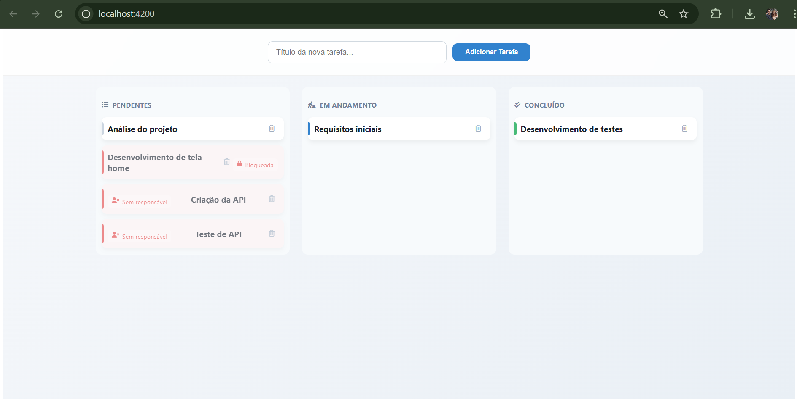
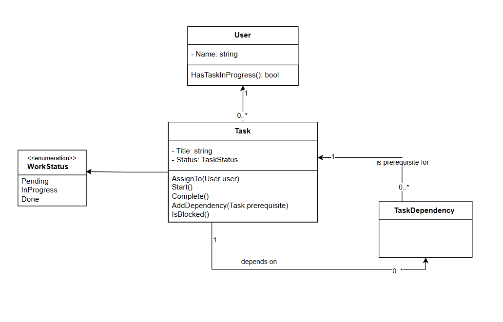
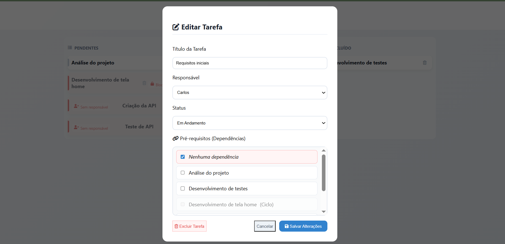
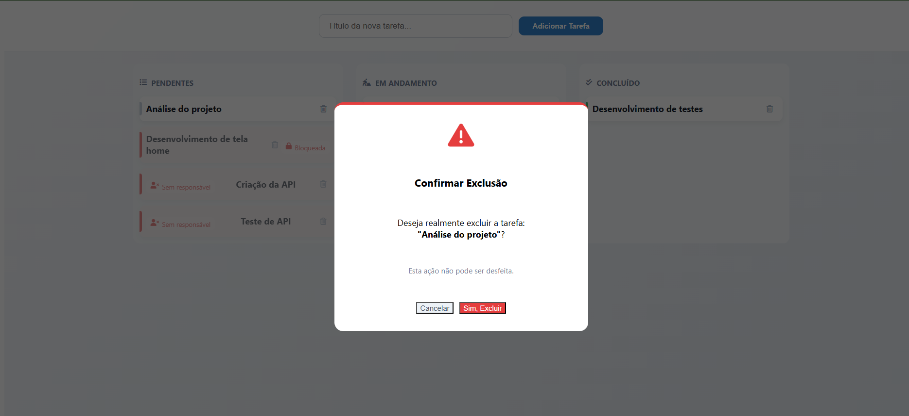

# 🚀 Task Flow: Gestor de Tarefas com Grafo de Dependências

Este projeto é uma solução Full Stack desenvolvida para um desafio técnico, focada em resolver problemas complexos de fluxo de trabalho e regras de negócio rígidas. O sistema gerencia tarefas através de um quadro Kanban, aplicando restrições de dependência e controle de carga de trabalho.

## 🎯 O Desafio
O objetivo era criar um sistema funcional onde:

Tarefas possuem pré-requisitos: Uma tarefa não pode ser concluída se suas dependências não estiverem prontas.

Proibição de Multitasking: Um colaborador só pode ter uma tarefa "Em Andamento" por vez.

Prevenção de Ciclos: O sistema deve impedir dependências circulares (ex: A depende de B, que depende de A).

Feedback Visual: Interface clara indicando bloqueios e restrições de movimento.

## 📸 Visual do Projeto

### 1. Quadro Kanban Principal

*Interface reativa baseada no Angular CDK, permitindo a gestão visual das tarefas através de colunas de status.*

### 2. Modelagem de Dados (UML)

*Estrutura de classes evidenciando a relação de auto-relacionamento entre tarefas.*

#### 3. Edição de Tarefas

*Interface de edição para alteração de responsável, título e status com validações de negócio.*

#### 4. Exclusão de Tarefas

*Sistema de segurança que impede a remoção de tarefas que possuem dependentes ativos.*

#### 5. Documentação da API (Swagger)

*Visualização e teste dos endpoints da API desenvolvida em .NET 10.*

## ✨ Funcionalidades Técnicas

### 🧠 Algoritmo de Detecção de Ciclos (DFS)

Para garantir a integridade dos dados, implementei um algoritmo de busca em profundidade (DFS - Depth First Search) no Backend. Antes de salvar qualquer nova dependência, o sistema percorre o grafo de tarefas para verificar se a conexão criaria um loop infinito.

### 🛡️ Validação de Integridade no Backend
A regra de negócio é protegida no TaskService:

Carga de Trabalho: Validação via Entity Framework para garantir que um usuário não tenha múltiplos registros InProgress.

Estado de Bloqueio: Verificação de pré-requisitos antes de permitir a conclusão de uma tarefa.

### 🎨 Kanban Inteligente (Angular)
Bloqueio Visual: Cards bloqueados recebem estilização em tons de cinza e ícones de cadeado.

Drag & Drop Restritivo: O sistema intercepta movimentos inválidos e exibe notificações (Toasts) explicativas.

## 🛠️ Stack Tecnológica
Backend: .NET 10.0.101 (C#), Entity Framework Core.

Frontend: Angular 21.0.5 (Standalone Components), Angular CDK (Drag & Drop).

Ambiente: Node.js 24.11.1 e npm 11.6.2.

Arquitetura: Service Pattern e DTOs para desacoplamento de camadas.

## 🚀 Como Executar o Projeto

Pré-requisitos
SDK do .NET 10.0.101 ou superior.

Node.js e Angular CLI.

Passo a Passo
1. **Clone o repositório:**
   `git clone https://github.com/alexandrecarloss/desafio-math4green`

2. **Configuração do Backend:**
   * Navegue até a pasta: `backend/api-dotnet/API`
   * Execute: `dotnet ef database update`
   * Execute: `dotnet run`

3. **Configuração do Frontend:**
   * Navegue até a pasta: `frontend`
   * Execute: `npm install`
   * Execute: `ng serve`

4. **Acesse http://localhost:4200**

---

👨‍💻 Desenvolvido por:
**Carlos Alexandre** 🚀 [LinkedIn](https://www.linkedin.com/in/alexandrecarloss/) | [GitHub](https://github.com/alexandrecarloss/)
